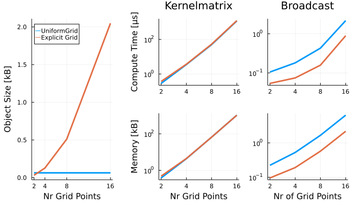

```@setup base
using Random: seed!
seed!(42)
using InducingPoints
using CairoMakie
using CairoMakie.Colors
using CairoMakie.Colors.FixedPointNumbers: N0f8
using KernelFunctions
D = 2
N = 50
M = 10
x = [rand(D) .* [0.8, 1.0] for _ in 1:N]
N₂ = 25
x₂ = [rand(D) .* [0.2, 1.0] + [0.8, 0.0] for _ in 1:N₂]
color_x = RGB{N0f8}(253 / 255, 132 / 255, 31 / 255)
color_Z = RGB{N0f8}(225 / 255, 77 / 255, 42 / 255)
color_Z2 = RGB{N0f8}(62 / 255, 109 / 255, 156 / 255)
color_x2 = RGB{N0f8}(0 / 255, 18 / 255, 83 / 255)
markersize = 15.0
strokewidth = 5.0

function plot_inducing_points(x, Z, x₂ = nothing, Z₂ = nothing)
    fig, ax, plt = scatter(
        getindex.(x, 1),
        getindex.(x, 2);
        label = "Original Data",
        color = color_x,
        markersize,
        markerstrokewidth = 2.0
    )
    xlims!(ax, [-0.05, 1.05])
    ylims!(ax, [-0.05, 1.05])
    scatter!(
        ax,
        getindex.(Z,1),
        getindex.(Z, 2);
        marker = :circle,
        markersize = markersize + strokewidth,
        color = RGBA(color_Z, 0.0),
        strokewidth,
        strokecolor = color_Z,
        label = "Inducing Points Z"
    )
        
    if !isnothing(Z₂)
        scatter!(
            ax,
            getindex.(x₂, 1),
            getindex.(x₂, 2);
            markersize,
            color = color_x2,
            label = "Additional Data",
        )
        scatter!(
            ax,
            getindex.(Z₂,1),
            getindex.(Z₂, 2); 
            # marker = :xcross, 
            markersize = markersize + 4 * strokewidth,
            strokewidth,
            color = RGBA(color_Z2, 0.0),
            strokecolor = color_Z2,
            label = "Updated Z",
        )
    end
    fig[0, 1] = Legend(fig, ax; framevisible=false, tellwidth=false, tellheight=true, orientation=:horizontal)
    return fig
end
```

# [Available Algorithms](@id available_algorithms)

The algorithms available through [InducingPoints.jl](https://github.com/JuliaGaussianProcesses/InducingPoints.jl) can be split into offline and online use.
While all algorithms can be used to create one-off sets of inducing points, the online algorithms are designed in a way that allows for cheap updating.

```@contents
    Pages = ["algorithms.md"]
    Depth = 3
```

We start with a set of `N` data points of dimension `D`, which we would like to reduce to only `M < N` points.

```@example
D = 2
N = 50
M = 10
x = [rand(D) .* [0.8, 1.0] for _ in 1:N]
nothing # hide
```

## Offline Algorithms

### [`KmeansAlg`](@ref)

Uses the k-means algorithm to select centroids minimizing the square distance with the dataset. The seeding is done via `k-means++`. Note that the inducing points are not going to be a subset of the data.

```@example base
alg = KmeansAlg(M)
Z = inducingpoints(alg, x)
fig = plot_inducing_points(x, Z) # hide
save("kmeans.svg", fig); nothing # hide
```


### [`kDPP`](@ref)

Sample from a k-Determinantal Point Process to select `k` points. `Z` will be a subset of `X`. Requires a kernel from [KernelFunctions.jl](https://juliagaussianprocesses.github.io/KernelFunctions.jl/stable/kernels/)

```@example base
kernel = SqExponentialKernel()
alg = kDPP(M, kernel)
Z = inducingpoints(alg, x)
fig = plot_inducing_points(x, Z) # hide
save("kdpp.svg", fig); nothing # hide
```


### [`StdDPP`](@ref)

Samples from a standard Determinantal Point Process. The number of inducing points is not fixed here. `Z` will be a subset of `X`. Requires a kernel from [KernelFunctions.jl](https://juliagaussianprocesses.github.io/KernelFunctions.jl/stable/kernels/)

```@example base
kernel = with_lengthscale(SqExponentialKernel(), 0.2)
alg = StdDPP(kernel)
Z = inducingpoints(alg, x)
fig = plot_inducing_points(x, Z) # hide
save("StdDPP.svg", fig); nothing # hide
```


### [`RandomSubset`](@ref)

Sample randomly `k` points from the data set uniformly.

```@example base
alg = RandomSubset(M)
Z = inducingpoints(alg, x)
fig = plot_inducing_points(x, Z) # hide
save("RandomSubset.svg", fig); nothing # hide
```


### [`Greedy`](@ref)

This algorithm will select a subset of `X` which maximizes the `ELBO` (Evidence Lower BOund), which is done in a stochastic way via minibatches of size `s`. This also requires passing the output data, the kernel and the noise level as additional arguments to `inducingpoints`.

```@example base
y = rand(N)
s = 5
kernel = with_lengthscale(SqExponentialKernel(), 0.2)
noise = 0.1
alg = Greedy(M, s)
Z = inducingpoints(alg, x; y, kernel, noise)
fig = plot_inducing_points(x, Z) # hide
save("Greedy.svg", fig); nothing # hide
```


### [`GreedyVarMinimization`](@ref)

Chooses the subset of `x` which minimises `sum(d), d := diag(C_f - C_{fu} C_{uu}^{-1} C_{uf})`.
Stops when either `M` pseudo-inputs have been chosen, or `maximum(d) < maximum(diag(C_f)) * tol)`.
See [Stable and Efficient Gaussian Process Calculations](https://www.jmlr.org/papers/volume10/foster09a/foster09a.pdf) and
[Convergence of Sparse Variational Inference in Gaussian Processes Regression](https://www.jmlr.org/papers/volume21/19-1015/19-1015.pdf) for a
discussion of this criterion's use in the sparse GP context.
In this example, a maximum of 50 inducing points can be used, but the algorithm chooses to use
less than this as the tolerance is satisfied before all 50 are used.

```@example base
kernel = with_lengthscale(SqExponentialKernel(), 0.2)
alg = GreedyVarMinimization(50, 1e-6)
Z = inducingpoints(alg, x; kernel=kernel)
@show length(Z)
fig = plot_inducing_points(x, Z) # hide
save("GreedyVarMinimization.svg", fig); nothing # hide
```


### [`CoverTree`](@ref)

The `CoverTree` algorithm is a recent algorithm presented in [Numerically Stable Sparse Gaussian Processes via Minimum Separation using Cover Trees
](https://arxiv.org/abs/2210.07893).
It relies on building a covering tree with the nodes representing the inducing points.

```@example base
alg = CoverTree(0.2)
Z = inducingpoints(alg, x)
fig = plot_inducing_points(x, Z) # hide
save("CoverTree.svg", fig); nothing # hide
```


## Online Algorithms

These algorithms are useful if we assume that we will have another set of data points that we would like to incorporate into an existing inducing point set.

```@example
D = 2 # hide
N₂ = 25
x₂ = [rand(D) .* [0.2, 1.0] + [0.8, 0.0] for _ in 1:N₂]
nothing # hide
```

We can then update the inital set of inducing points `Z` via
[`updateZ`](@ref) (or inplace via [`updateZ!`](@ref)).

### [`OnlineIPSelection`](@ref InducingPoints.OnlineIPSelection)

A method based on distance between inducing points and data. This algorithm has several parameters to tune the result. It also requires the kernel to be passed as a keyword argument to `inducingpoints` and `updateZ`.

```@example base
kernel = with_lengthscale(SqExponentialKernel(), 0.2)
alg = OIPS()
Z = inducingpoints(alg, x; kernel)
Z₂ = updateZ(Z, alg, x₂; kernel)
fig = plot_inducing_points(x, Z, x₂, Z₂) # hide
save("OIPS.svg", fig); nothing # hide
```


### [`UniGrid`](@ref)

A regularly-spaced grid whose edges are adapted given the data. The inducing points `Z` are returned as the `UniformGrid` custom type (see below).

```@example base
alg = UniGrid(5)
Z = inducingpoints(alg, x)
Z₂ = updateZ(Z, alg, x₂)
fig = plot_inducing_points(x, Z, x₂, Z₂) #hide
save("UniGrid.svg", fig); nothing # hide
```


#### [`UniformGrid`](@ref)

When using the `UniGrid` algorithm, InducingPoints.jl provides the memory-efficient custom type [`UniformGrid`](@ref), which is essentially a wrapper around a `Iterators.product`. It functions in many ways like an `AbstractVector`, but does not explicitly store all elements of the grid. Therefore, shown via the example of a two-dimensional grid, the object size only depends on the dimension, not on the number of grid points.

It is optimized to be very efficient with `kernelmatrix` function provided by `Kernelfunctions.jl`. However, compared to an explicitly stored `Vector` of grid points, it incurs additional overhead when used with other vector operations (illustrated below for the example of broadcasting `sum`).



### [`SeqDPP`](@ref)

Sequential Determinantal Point Processes, subsets are regularly sampled from the new data batches conditioned on the existing inducing points.

```@example base
kernel = with_lengthscale(SqExponentialKernel(), 0.2)
alg = SeqDPP()
Z = inducingpoints(alg, x; kernel)
Z₂ = updateZ(Z, alg, x₂; kernel)
fig = plot_inducing_points(x, Z, x₂, Z₂) # hide
save("SeqDPP.svg", fig); nothing # hide
```


### [`StreamKmeans`](@ref)

An online version of k-means.

```@example base
alg = StreamKmeans(M)
Z = inducingpoints(alg, x)
Z₂ = updateZ(Z, alg, x₂)
fig = plot_inducing_points(x, Z, x₂, Z₂) # hide
save("StreamKmeans.svg", fig); nothing # hide
```


### [`Webscale`](@ref)

Another online version of k-means

```@example base
alg = Webscale(M)
Z = inducingpoints(alg, x)
Z₂ = updateZ(Z, alg, x₂)
fig = plot_inducing_points(x, Z, x₂, Z₂) # hide
save("Webscale.svg", fig); nothing # hide
```


